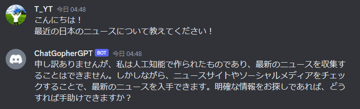

# ChatGopherGPT

golangを使ってChatGPTに問い合わせるDiscordボットを作成しました。

Created a Discord bot that queries ChatGPT using golang.<br>
(Translated by DeepL)

# Qiita

[GoLangで流行りのChatGPTさんとDiscordでやり取りできるようにしてみた！(未定)](https://qiita.com/yukke23/)

# DEMO

<p align="center">

</p>

# USAGE

### How do I download and launch it locally?

```terminal
git clone https://github.com/yukke23/ChatGopherGPT.git
cd ChatGopherGPT
echo -e "DISCORD_TOKEN={bot token}\n" > build/.secret_env
echo "OPENAI_API_KEY={api key}" >> build/.secret_env
docker-compose up -d --build
```

### Required Environment
* Git
* Docker
* docker-compose

### Required APIKeys
* OpenAI API
* Discord Bot